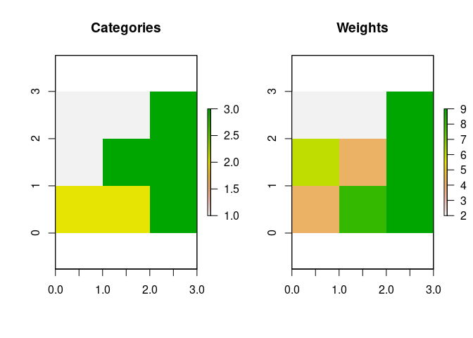

<!-- README.md is generated from README.Rmd. Please edit that file -->

# comat

<!-- badges: start -->

[](https://travis-ci.org/Nowosad/wecoma)
[](https://codecov.io/gh/Nowosad/wecoma?branch=master)
<!-- badges: end -->

The goal of **comat** is to create cooccurrence matrices based on
spatial data, including a weighted coocurrence matrix
(*wecoma*).

## Installation

<!-- You can install the released version of comat from [CRAN](https://CRAN.R-project.org) with: -->

<!-- ``` r -->

<!-- install.packages("comat") -->

<!-- ``` -->

You can install the development version from
[GitHub](https://github.com/) with:

``` r
# install.packages("devtools")
devtools::install_github("Nowosad/wecoma")
```

## Example

This is a basic example which shows you how to create a weighted
cooccurrence matrix based on two simple rasters. The first one `x`
represents some categories, and the second one `w` represents weights.

``` r
library(comat)
library(raster)
#> Loading required package: sp
data(x, package = "comat")
data(w, package = "comat")
par(mfcol = c(1, 2))
plot(x, main = "Categories")
plot(w, main = "Weights")
```



The `get_wecoma` function can be next used to create a weighted
cooccurrence matrix.

``` r
get_wecoma(x, w)
#>      1    2    3
#> 1 12.0  5.0 13.5
#> 2  5.0 12.0 14.5
#> 3 13.5 14.5 49.0
```

This function allows for some parametrization using additional
arguments, e.g. :

``` r
get_wecoma(x, w, fun = "focal", na_action = "keep")
#>    1  2  3
#> 1 12  6 10
#> 2  4 12 16
#> 3 17 13 49
```
